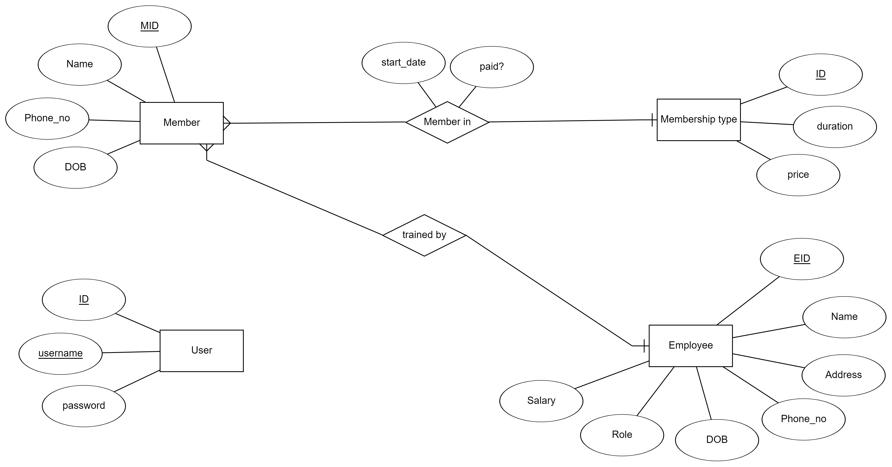

# Gym management system

# Requirements Document

## Preface:

This iteration **1** of the requiremens document. This document is expected to be read by the engineers working on the project, the users that should benefit from the project and the engineering team leader.

## Introduction:

The need for this system arises from the expanding demand on **gyms**. A mangement system for such an entity is reqired to make employees life easire makes it easier for managers to track what is happening and generate reports.

## Glossary:

- **User:** The main target user of the system is the **gym manager**.

- **Member:** Refers to the customers that need to be tracked and stored in the **management system** (members of the gym).

- **Employee:** General term refers to the employees in the gym, but they won't have direct access to the system. This include **accountants** and **personal trainers**.

- **Server:** a computer program or device that provides a service to another computer program.

- **Client:** a computer or a program that, as part of its operation, relies on sending a request to another program or a computer hardware or software that accesses a service made available by a server.

- **Database:** a structured set of data held in a computer, especially one that is accessible in various ways.

- **Tuple:** one row in a database.

## User requirements definition:

### Functional requirements:

1. User shall login to the system and verify his identity.

2. User shall add new members.

3. User shall add new employees.

4. User shall change members data.

5. User shall change employees data.

6. User shall add new memberships.

7. User shall generate monthly income reports.

8. User shall track every member invitations and membership status.

9. User shall be able to search for a specific member.

10. User shall be able to search for a specific employee.

11. User shall manage prices and discounts.

### Non-functional requirements:

1. Ease of use.

2. Security.

3. Robustness.

4. Reliability.

## System architecture:

We will use **server-client architecture**, server will contain the database and all the information of the members and employees while client will be the link between the user and the server.

## System requirements specification:

### Functional requirements:

1. Login will make a request to the database to verify the credentials of the manager.

2. User will have a form that he will enter the new member information into and this infomation shall be add as a tuple in the database.

3. User will have a form that he will enter the new employee information into and this information shall be add as a tuple in the database.

4. User shall search using the member's name, ID or phone number then select the piece of information that he wants to change.

5. User shall search using the employee's name, ID or phone number then select the piece of information that he wants to change.

6. User will have a form that he will enter the infromation necessary for a new membership (information will be specified in the Database schema).

7. User shall select a month, the member will request the information from the server and the server shall reply with the necessary information for the monthly income report.

8. User shall get notified when a membership expires.

9. User shall search for a member using his name, ID or phone number.

10. User shall search for an employee using his name, ID or phone number.

11. User shall see prices corresponding to the duration of each membership and shall be able to change this prices.

### Non-functional requirements:

1. It shall take no longer than **three hours** for the user to learn the system and get to an average of **three misuses**per hour.

2. Credentials of the user should be encrypted.

3. System shall take no longer than **five minutes**to restart after failure.

4. System shall fail **less than three times per day**.

## System evolution:

System is designed based on the assumptions that a wider variety of users may use the system includeing for example employees and it's assumed that the system can be upgraded to a web based app that's what motivated using the client-server architecture.

## Appendices:

# Software process

## Suggested software process:

The software process suggested was an **incremental-agile** approach, where the specification, development and validation processes are interleaved.

Why was this approach suggested:

- Time was of the essence.

- We wanted to release a working version in the shortest possible time.

- Since we are a **group of 3** (Small team), **agile approach**was suitable.

## Phases:

The taken approach means that each successive version of the product is usable and each version adds some usabilitiy and functionality to the system.

Phases used include:

- Requirements.

- Design.

- Implementation.

- Testing.

With the constraint that there is no real customer and this project is more of a simulation a few assumptions were made and some constaints were added including:

- Requirements was no modifeid a lot throughout the project because there was no customer at hand, so **requirements document** were written at the beginning of the project and has not changed much since then.

- Testing was made on a subset of features not the system as a whole.

- Since this is a management system, The ERD was the first diagram to be made and the most crucial one. It was highly utillized during the implementation phase. with specific requirements it also didn't change that much.

# Architectural design

## Suggested system architecture

The system architecture suggested for this project was **client-server architecure.**

Although this system is designed for a single computer the client-server architecture allows for future evolving of the project to be distributed accros a network and the ability to add several number of other clients (including phones).

Reasons for using this architecture:

- Better system evolving.

- Efficiency in delivering resources to the client.

- Since the system is centralized, it can be easily **secured and maintained**. althought a single point of failure is regarded as a disadvantage, it allows for easirer maintenance and with a system that is not crucial it can tolerate occasional failure.

- More clients can be added whenever we desire.

## Suggested application architecture

The application architecture suggested and used for this project is **MVC**.

With a highly interactive appilcation rose the necesity for the separation between the **GUI** and the **logic** of the application. facilitated by using a database and a client-server architecture, it was an easy to task to apply MVC to our project.

# Design document

This project is build using on a **Client-server Architecture** (discussed in the previous section).

**OOP** was used in this project, since it's the most suitable for our application. which consists of: Member, employee, user and membership type.

using **OOP** made it easier to model the database tables to our application using **ORM**(object relational model) and **DAO**(data access object). also made it possible to use **UML diagrams**to help in the design process.

## Entity relationship diagram

## UML diagrams

### use case diagram:

A **use case diagram** is a graphical depiction of a user's possible interactions with a system. A use case diagram shows various use cases and different types of users the system has and will often be accompanied by other types of diagrams as well. The use cases are represented by either circles or ellipses. The actors are often shown as stick figures.

### Class diagram:

A type of static structure diagram that describes the structure of a system by showing the system's classes, their attributes, operations (or methods), and the relationships among objects.

### State machine diagram:

models the behaviour of a single object.

### Sequence diagram:

shows process interactions arranged in time sequence.

### Activity diagram:

graphical representations of workflows of stepwise activities and actions.

## Design description

With focuse on ease of use and good GUI the system was fairly system with system working as follow:

1. Entering credentials in the login screen.

2. Login screen transfers you to the main menu screen.

3. In the main menu, several buttons exists with each button describing what it does.

## Implementation

enviroment and tools used by all the team:

- [MySQL](https://www.mysql.com/) as a **relational database management system**.

- [Java](https://www.java.com/en/https://www.java.com/en/) was the language of choice.

- [IntelliJ IDEA]([IntelliJ IDEA: The Capable & Ergonomic Java IDE by JetBrains](https://www.jetbrains.com/idea/)) was used by the whole team for writing **Java** code.

- **JDK 8.1.3** was used.

- [Visual Studio Code](https://code.visualstudio.com/) was used for manipulating database **DDL**.

> This document was supposed to be written according to the [IEEE 1016-2009]([1016-2009 - IEEE Standard for Information Technology--Systems Design--Software Design Descriptions | IEEE Standard | IEEE Xplore](https://ieeexplore.ieee.org/document/5167255)), but since it requires a paid access we haven't been able to follow its guidelines, so this a design document based on what we have studied.
